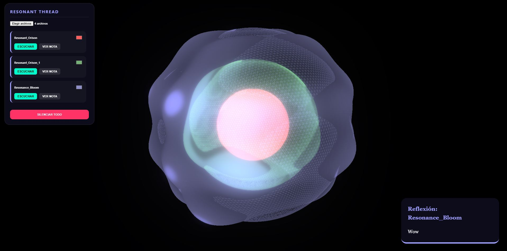

# Resonant Planetary Soundscape

**Resonant Planet** es una biósfera sónica interactiva que transforma archivos de audio y texto en capas geológicas de un planeta de conciencia.

## 🚀 Funcionalidades
- **Motor de Plasma Armónico:** Visualización basada en interferencia de ondas (Seno/Coseno) para un movimiento fluido y rítmico.
- **ADN Cromático Individual:** Selector de color por capa para mapeo emocional de sesiones.
- **Consola de Mezcla Granular:** Play/Pause independiente para cada registro sónico.
- **Lector de Reflexiones:** Acceso directo a archivos .txt vinculados por nombre al audio.

## 🛠 Arquitectura Visual
1. **Centro (Origen):** Representa las primeras grabaciones (Día 1).
2. **Capas Exteriores (Evolución):** Grabaciones más recientes con mayor complejidad geométrica.
3. **Malla DUAL:** Cada capa proyecta un "Esqueleto" (Wireframe) y una "Piel" (Plasma Shader).

## 💡 Cómo usar
1. Sube una carpeta que contenga tus audios (`.mp3`/`.wav`) y tus notas correspondientes (`.txt`).
2. Usa la consola izquierda para teñir tus frecuencias y activar los hilos de sonido.
3. Haz clic en 'Nota' para revivir tus pensamientos de aquel momento.

---
*Visualizado con Three.js & Custom GLSL Shaders.*

---

**Made with ❤️ and ☕ by Plantacerium**

⭐ **Star us on GitHub** ⭐

---
